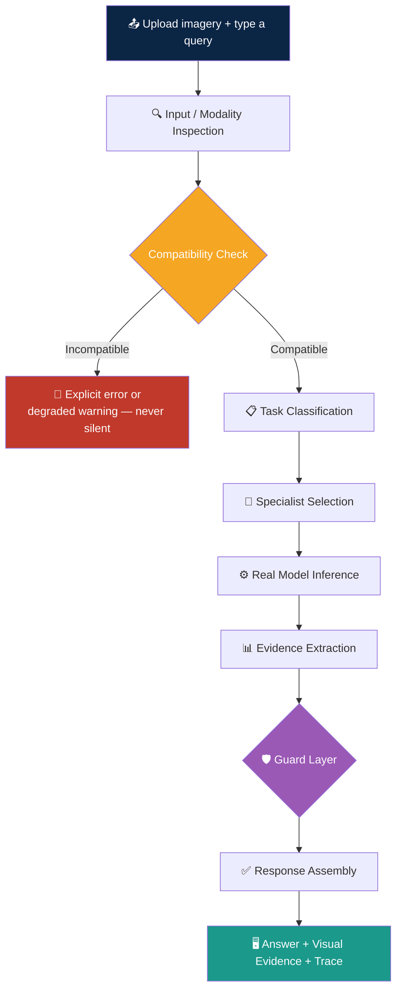

<p align="center">
  
  
  
  
  
  
  
</p>

<h1 align="center">🛰️ SatQuery AI</h1>

<p align="center">
  <strong>An Agentic Vision-Language Assistant for Multimodal Remote-Sensing Image Analysis</strong><br/>
  <em>Ask a satellite image a question in plain English. An orchestrator — not a human, not a switch statement —<br/>
  reads the query, picks the right remote-sensing specialist, runs it, checks its own output, and answers with evidence.</em>
</p>

<p align="center">
  <a href="#-why-this-exists">Why</a> •
  <a href="#-capabilities">Capabilities</a> •
  <a href="#️-system-architecture">Architecture</a> •
  <a href="#-agentic-workflow">Workflow</a> •
  <a href="#-model-zoo">Model Zoo</a> •
  <a href="#-safety--reliability-engineering">Safety Engineering</a> •
  <a href="#-getting-started">Getting Started</a> •
  <a href="#-evaluation">Evaluation</a> •
  <a href="#-team">Team</a>
</p>

---

## 🎯 Why This Exists

Built for **Smart India Hackathon 2026**, Problem Statement **26167**, issued by **ISRO / the Space Applications Centre (SAC)**.

Most remote-sensing AI is a drawer of single-purpose tools — one model for land-cover classification, another for change detection, a third for object counting — each demanding that the user already understand GIS workflows and model selection before asking a single question.

The problem statement is explicit: **a generic vision-language model without remote-sensing adaptation does not satisfy the requirement.** So every specialist in SatQuery AI is either fine-tuned on remote-sensing data or trained from scratch on a named remote-sensing benchmark — nothing here is a general-purpose chatbot with a satellite photo pasted in.

---

## ✨ Capabilities

<table>
<tr>
<td width="50%">

### 🔍 Remote-Sensing VQA
Free-form questions about land cover, objects, and scene content, answered by **SmolVLM-500M-Instruct + a LoRA adapter fine-tuned on BigEarthNet** — not the base model, a domain-adapted one.

</td>
<td width="50%">

### 📝 Scene Captioning
The same fine-tuned backbone produces structured natural-language scene descriptions, filtered through a **hallucination guard** before anything reaches the user.

</td>
</tr>
<tr>
<td width="50%">

### 🎯 Text-Guided Grounding
Zero-shot, open-vocabulary localization via **Grounding DINO** — "highlight the water body," "where are the houses" — returns real bounding boxes with a genuine, measured detection confidence.

</td>
<td width="50%">

### 🔄 Bi-Temporal Change Detection
A **from-scratch Siamese U-Net** (true weight-shared encoder, multi-level feature differencing — not an image-difference trick) trained on **LEVIR-CD**, producing a pixel-level change mask plus percentage-changed, severity, and location statistics.

</td>
</tr>
<tr>
<td width="50%">

### 💬 Change-VQA & Conversational Follow-Up
Ask a natural-language question about the detected change, then keep asking in the same thread — follow-ups reuse already-computed evidence instead of re-running detection from scratch.

</td>
<td width="50%">

### 🌐 Optical + SAR Fusion
A **custom dual-branch gated fusion network** — separate encoders for optical and SAR, combined through a learned sigmoid gate — estimates built-up / water / vegetation composition from a co-registered Sentinel-1/2 pair.

</td>
</tr>
<tr>
<td width="50%">

### 🛡️ Zero-Fabrication Confidence Policy
Detection confidence (grounding) and classification probability (change detection, fusion) are real, measured quantities and are shown. VQA/captioning confidence is **intentionally withheld** — token-likelihood doesn't predict correctness, so we don't dress it up as one.

</td>
<td width="50%">

### 🤖 Agentic Orchestration
A controller classifies the query, validates input compatibility, selects the specialist(s), and returns a **full auditable execution trace** — task, model, parameters, evidence — for every single request.

</td>
</tr>
</table>

---

## 🏗️ System Architecture

```
┌────────────────────────────────────────────────────────────────────────┐
│                          SatQuery AI Platform                          │
├────────────────────────────────────────────────────────────────────────┤
│                                                                        │
│  ┌──────────────────────────────────────────────────────────────┐    │
│  │              Frontend (React + TypeScript + Vite)              │    │
│  │  ┌──────────┐  ┌───────────┐  ┌───────────┐  ┌─────────────┐  │    │
│  │  │  Upload  │  │  Analysis │  │  Execution │  │   History /  │  │    │
│  │  │  Portal  │  │  Console  │  │   Trace    │  │   Reports    │  │    │
│  │  └────┬─────┘  └─────┬─────┘  └───────────┘  └─────────────┘  │    │
│  └───────┼──────────────┼─────────────────────────────────────────┘    │
│          ▼              ▼                                              │
│  ┌──────────────────────────────────────────────────────────────┐    │
│  │                   FastAPI Backend (Python 3.12)                │    │
│  │                                                                  │    │
│  │  ┌────────────────────────────────────────────────────────┐    │    │
│  │  │      Input Compatibility Layer                           │    │    │
│  │  │   Modality / Format Check → Pair Validation → Guard      │    │    │
│  │  └──────────────────────────┬─────────────────────────────┘    │    │
│  │                             │                                    │    │
│  │  ┌──────────────────────────▼─────────────────────────────┐    │    │
│  │  │        Task Classifier & Agentic Orchestrator            │    │    │
│  │  │   Query Intent → Tool Selection → Specialist Dispatch    │    │    │
│  │  └────┬──────────────┬───────────────┬─────────────────────┘    │    │
│  │       ▼              ▼               ▼               ▼          │    │
│  │  ┌─────────┐  ┌───────────┐  ┌──────────────┐  ┌─────────────┐ │    │
│  │  │ RS-VQA /│  │  Change   │  │ Optical+SAR  │  │  Text-Guided │ │    │
│  │  │Caption. │  │ Detector  │  │   Fusion     │  │   Grounding  │ │    │
│  │  │SmolVLM +│  │ Siamese   │  │ Dual-Branch  │  │  Grounding   │ │    │
│  │  │  LoRA   │  │  U-Net    │  │  Gated Net   │  │    DINO      │ │    │
│  │  └─────────┘  └───────────┘  └──────────────┘  └─────────────┘ │    │
│  │                                                                  │    │
│  │  ┌────────────────────────────────────────────────────────┐    │    │
│  │  │           Guard Layer + Evidence Assembly                 │    │    │
│  │  │  Hallucination Guard │ OOD Guard │ Grounding Scope Guard  │    │    │
│  │  └────────────────────────────────────────────────────────┘    │    │
│  │                                                                  │    │
│  │  ┌──────────────────┐   ┌──────────────────────────────────┐   │    │
│  │  │  SQLite Storage  │   │   JWT Auth + Google/GitHub OAuth   │   │    │
│  │  └──────────────────┘   └──────────────────────────────────┘   │    │
│  └────────────────────────────────────────────────────────────────┘    │
└────────────────────────────────────────────────────────────────────────┘
```

---

## 🔄 Agentic Workflow



### Mode 1 — Single-Image VQA / Captioning / Grounding

```
Upload optical or SAR image (GeoTIFF / TIFF / benchmark PNG-JPEG)
    → Modality & format detection
    → Task classification (vqa / captioning / grounding)
    → SmolVLM-500M + LoRA   — OR —   Grounding DINO (zero-shot)
    → Hallucination guard (captioning) / scope guard (grounding)
    → Answer + evidence + execution trace
```

### Mode 2 — Bi-Temporal Change Detection & Change-VQA

```
Upload Before (T1) + After (T2) images, same location
    → Pair compatibility & dimension validation
    → Siamese U-Net inference → binary change mask + % changed + severity
    → OOD guard (compound near-zero-change + z-score check)
    → Deterministic template answer, built from real detector stats
    → Conversational follow-up reuses the same computed evidence
```

### Mode 3 — Optical + SAR Fusion

```
Upload co-registered optical (Sentinel-2) + SAR (Sentinel-1) pair
    → GeoTIFF / SAR calibration handling (linear power vs. dB detection)
    → Dual-branch gated fusion network → built-up / water / vegetation composition
    → OOD guard (reused from change detection, generalized to a second modality)
    → Deterministic template answer, built from real classifier output
```

---

## 🔬 Specialist Tool Registry

| Specialist | Engine | Domain | Status |
|:---|:---|:---|:---:|
| **RS-VQA** | SmolVLM-500M-Instruct + LoRA | BigEarthNet-adapted VQA | 🟢 Active |
| **RS Captioning** | SmolVLM-500M-Instruct + LoRA | Scene description + hallucination guard | 🟢 Active |
| **Text-Guided Grounding** | Grounding DINO | Zero-shot open-vocabulary localization | 🟢 Active |
| **Change Detector** | Custom Siamese U-Net | LEVIR-CD building change | 🟢 Active |
| **Change-VQA** | Siamese U-Net + SmolVLM temporal reasoning | Deterministic change narratives | 🟢 Active |
| **Optical+SAR Fusion** | Custom dual-branch gated fusion net | Sentinel-1/Sentinel-2 joint analysis | 🟢 Active |
| **Hallucination Guard** | Rule-based filter | Fabricated place/area/date detection | 🟢 Active |
| **OOD Guard** | Statistical z-score check | Cross-dataset distribution-shift detection | 🟢 Active |
| **Semantic Change Detection** | Multi-class upgrade to the Siamese U-Net | Class-aware change ("what changed") | 🔵 Roadmapped |
| **LAE-DINO Grounding** | Remote-sensing-native detector | Dense-scene / wide-area localization | 🔵 Roadmapped |

---

## 🏆 Model Zoo

### RS-VQA / Captioning — SmolVLM-500M-Instruct + LoRA

| Detail | Value |
|:---|:---|
| Base model | `HuggingFaceTB/SmolVLM-500M-Instruct` |
| Adaptation | PEFT LoRA, fine-tuned on BigEarthNet.txt |
| Training | 3 epochs — train loss 0.897 → 0.340, val loss 0.559 → 0.345 (monotonic, no train/val gap) |
| Held-out accuracy | 63–73% on binary/MCQ-style questions |
| Safety layer | Rule-based hallucination guard (fabricated country/area/date filtering) |

### Change Detection — Custom Siamese U-Net

| Detail | Value |
|:---|:---|
| Architecture | True weight-shared Siamese encoder, multi-level feature differencing (FC-Siam-diff style) |
| Parameters | 7.76M |
| Training data | LEVIR-CD |
| Output | Binary change mask + % changed + severity + location |
| Answer generation | Deterministic template from real detector stats — no free-form VLM narration |

### Optical + SAR Fusion — Dual-Branch Gated Fusion Network

| Detail | Value |
|:---|:---|
| Architecture | Two independent CNN encoders (optical 3-ch, SAR 2-ch) + learned sigmoid gate |
| Parameters | 1,045,299 (1.05M) |
| Training | 20 epochs on BigEarthNet Sentinel-1/2 pairs, weak multi-label supervision |
| Best macro-F1 | 0.482 (val loss 0.173) |
| Strong classes | Arable land 0.91, Broad-leaved forest 0.90, Inland waters 0.73, Urban fabric 0.70 |

### Grounding — Grounding DINO (Zero-Shot)

| Detail | Value |
|:---|:---|
| Mode | Zero-shot open-vocabulary detection, no remote-sensing fine-tune |
| Output | Bounding boxes + real detection confidence |
| Safety layer | Scope guard flags near-full-image boxes as low-confidence localization |

---

## 🛡️ Safety & Reliability Engineering

This is the section most teams skip. We didn't.

- **Deterministic, evidence-grounded answers** for change detection and fusion — both were caught early on inventing details (a "parking lot" that didn't exist) when left to free-form VLM narration. Both now build answer text exclusively from real, computed detector output.
- **Hallucination guard** — strips fabricated country names, invented area/sqm figures, and made-up capture dates from captioning output. Every rule was added after a specific observed failure, then tested against false-positive traps (pixel dimensions, aspect ratios, scale bars) so it doesn't over-fire.
- **Out-of-distribution guard** — statistical z-score comparison against a training-distribution reference profile, extended to a compound two-tier check after cross-dataset testing (LEVIR-CD → OSCD, BigEarthNet → SEN12MS-CR) revealed a real coverage gap in the original design.
- **Grounding scope guard** — a bounding box covering most of the image is flagged as a failed localization, not returned as a confident detection.
- **No silent failures** — every incompatible-input scenario (wrong image count, mismatched pair dimensions, SAR-only pair submitted as cross-modal) either hard-errors with a specific message or soft-degrades with an explicit, traced warning, verified with negative controls.

---

## 🚀 Getting Started

### Backend

```bash
cd backend
python -m venv venv
./venv/Scripts/activate        # Windows
# source venv/bin/activate     # macOS / Linux

pip install -r requirements.txt
uvicorn app.main:app --reload --host 127.0.0.1 --port 8000
```

- API docs: `http://127.0.0.1:8000/docs`
- Health check: `http://127.0.0.1:8000/health`

### Frontend

```bash
cd frontend
npm install
cp .env.example .env      # VITE_API_URL=http://localhost:8000
npm run dev
```

- App: `http://localhost:5173`

> **Note:** Real-mode inference loads SmolVLM-500M, the Siamese U-Net checkpoint, the fusion network, and Grounding DINO — set `VQA_MODE` / `CHANGE_MODE` / `FUSION_MODE` / `GROUNDING_MODE=real` in `backend/.env` (default is `mock` for fast, GPU-free routing tests).

---

## 📂 Project Structure

```
SatQuery-AI/
├── backend/
│   ├── app/
│   │   ├── main.py
│   │   ├── models.py                 # SQLAlchemy models (User, AnalysisRecord, ...)
│   │   ├── routers/                  # auth, analysis, reports, health
│   │   └── services/
│   │       ├── orchestrator.py       # agentic controller
│   │       ├── task_classifier.py
│   │       ├── vqa_service.py
│   │       ├── change_service.py
│   │       ├── fusion_service.py
│   │       ├── grounding_service.py
│   │       ├── hallucination_guard.py
│   │       ├── ood_guard.py
│   │       └── geo_preprocessing.py
│   ├── tests/                        # orchestrator routing + compatibility tests
│   └── evaluation_results/           # RSVQA / VRSBench / CDVQA / fusion results
├── frontend/
│   └── src/
│       ├── components/
│       └── pages/
└── README.md
```

---

## 📡 API Overview

Interactive Swagger UI at [`http://localhost:8000/docs`](http://localhost:8000/docs) once the backend is running.

| Method | Endpoint | Purpose | Auth |
|:---:|:---|:---|:---:|
| `POST` | `/analysis` | Run a query against uploaded imagery | Optional |
| `GET` | `/analysis/{id}` | Retrieve a past analysis | Optional |
| `GET` | `/analysis/history` | List past analyses for the user | Required |
| `POST` | `/auth/register` | Create an account | — |
| `POST` | `/auth/login` | Email/password login | — |
| `GET` | `/auth/google/login` / `/auth/github/login` | OAuth login | — |
| `GET` | `/auth/me` | Current user profile | Required |
| `GET` | `/health` | Liveness check | — |

*(See `backend/app/routers/` for the current authoritative route list.)*

---

## 📊 Evaluation

Evaluated against the exact public benchmarks the problem statement names — not friendlier substitutes — with sourcing verified against the official releases (Zenodo record match, image-and-answer-level cross-check) before a single number was computed.

| Benchmark | Task | Result |
|:---|:---|:---|
| **BigEarthNet** (held-out) | VQA/captioning fine-tune validation | Monotonic loss improvement over 3 epochs; 63–73% held-out accuracy on binary/MCQ questions |
| **RSVQA-LR** | VQA accuracy by category | Sourcing verified pixel-for-pixel against the official Zenodo release; strong on presence/comparison categories |
| **VRSBench** | Captioning / VQA / grounding | Official release confirmed; grounding stress-tested against real remote-sensing scenes across scene densities |
| **CDVQA** | Change-based VQA | Structural finding: a class-aware upgrade to the change detector is the identified next step to unlock class-specific change questions|
| **Optical + SAR Fusion** | Multi-label composition (BigEarthNet-19) | Macro-F1 0.482; strong performance on high-support classes (Arable land 0.91, Urban fabric 0.70) |

Every number was produced by running inference through the **real orchestrator pipeline** against the actual official benchmark data — not a bypassed direct model call.

---

## 👥 Team

<p align="center"><strong>Orbital Minds 133</strong></p>
<p align="center">Smart India Hackathon 2026 · Problem Statement 26167 · Indian Space Research Organisation (ISRO)</p>

---

<p align="center"><em>Built for judges who read the code, not just the demo.</em></p>
