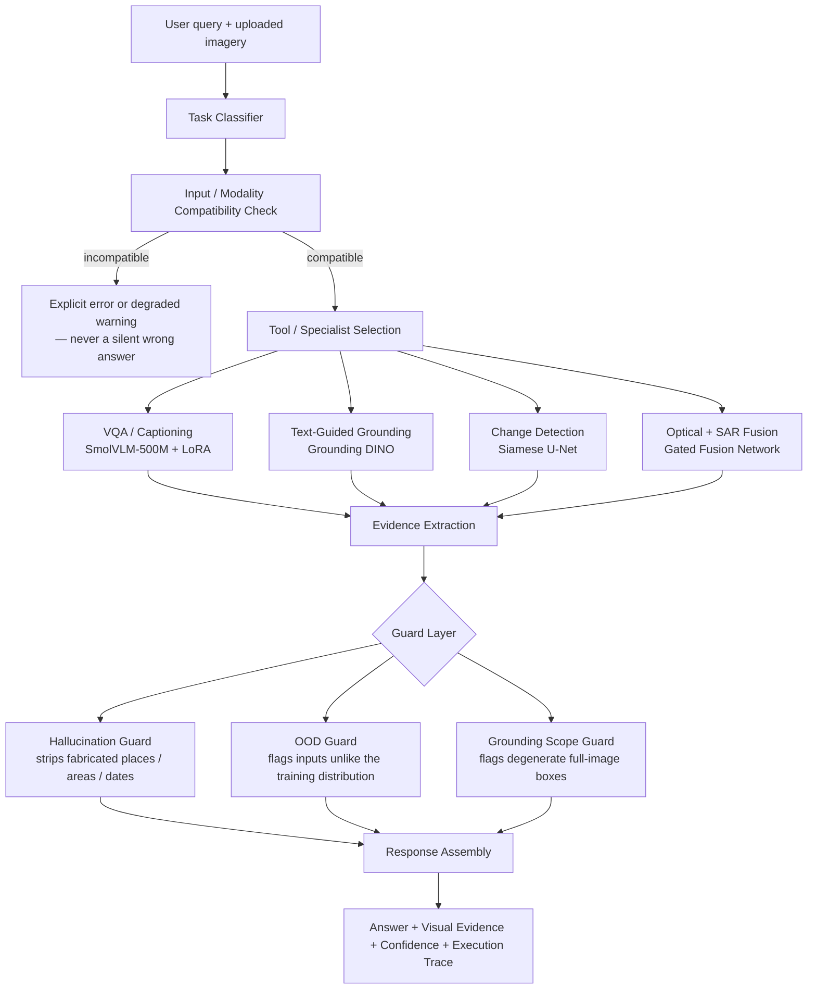

# SatQuery AI

**An agentic vision-language assistant for multimodal remote-sensing image analysis — through plain-text questions.**

[](#)
[](#)
[](#)
[](#)
[](#)
[](#)
[](#license)

> Built for **Smart India Hackathon 2026**, Problem Statement **26167** — *"SatQuery AI: An Interactive Vision-Language Assistant for Multimodal Remote Sensing Image Analysis through Text Queries"*, issued by the Indian Space Research Organisation (ISRO) / Space Applications Centre (SAC).

---

## Table of Contents

- [Why SatQuery AI](#why-satquery-ai)
- [What It Does](#what-it-does)
- [System Architecture](#system-architecture)
- [Agentic Orchestration, Step by Step](#agentic-orchestration-step-by-step)
- [Safety & Reliability Engineering](#safety--reliability-engineering)
- [Model Inventory](#model-inventory)
- [Input Compatibility Matrix](#input-compatibility-matrix)
- [Tech Stack](#tech-stack)
- [Screenshots](#screenshots)
- [Getting Started](#getting-started)
- [Project Structure](#project-structure)
- [API Overview](#api-overview)
- [Evaluation](#evaluation)
- [Known Limitations](#known-limitations)
- [Roadmap](#roadmap)
- [Team](#team)
- [License](#license)

---

## Why SatQuery AI

Remote-sensing AI today is a drawer full of single-purpose tools: one model for land-cover classification, another for change detection, a third for object detection — each demanding that the user already understand GIS workflows, sensor characteristics, and model selection before they can ask a single question.

**SatQuery AI removes that requirement.** You upload imagery, type a question in plain English, and an **agentic controller** — not a human, not a hardcoded if/else chain — decides which specialist model (or combination of models) your question actually needs, runs it, checks its own output for red flags, and hands back an answer backed by real, inspectable evidence.

This isn't a thin wrapper around a general-purpose LLM. The problem statement is explicit that a generic vision-language model without remote-sensing adaptation does not satisfy the requirement — so every specialist in this system is either fine-tuned on remote-sensing data or trained from scratch on a remote-sensing benchmark. Nothing here is "ChatGPT with a satellite photo pasted in."

## What It Does

| Capability | Input | What happens |
|---|---|---|
| **Visual Question Answering** | Single optical/SAR image | A BigEarthNet-adapted vision-language model answers free-form questions about land cover, objects, and scene content. |
| **Scene Captioning** | Single optical/SAR image | The same fine-tuned model produces a structured natural-language description of the scene. |
| **Text-Guided Grounding** | Single image + a phrase | Zero-shot open-vocabulary detection (Grounding DINO) draws bounding boxes around whatever the query refers to — "the water body," "the houses" — with a real, measured detection confidence. |
| **Bi-Temporal Change Detection** | Two images, same location, different dates | A custom Siamese U-Net localizes and quantifies change pixel-by-pixel; a deterministic answer template (not free-form generation) reports the percentage changed, severity, and location — grounded in the actual computed statistics. |
| **Change-VQA & Conversational Follow-Up** | Bi-temporal pair + a question | Ask about the change in natural language, then keep asking — follow-ups reuse the already-computed evidence instead of re-running detection. |
| **Optical + SAR Fusion** | Co-registered optical and radar image pair | A dual-branch gated fusion network combines spectral (optical) and structural (SAR, day/night, cloud-penetrating) information to estimate built-up, water, and vegetation composition. |
| **Agentic Orchestration** | Any of the above | A controller classifies the query, validates input compatibility, selects the right specialist(s), and returns a full, auditable execution trace — task, model, parameters, and evidence. |

## System Architecture



Every box in that diagram is a real, separately testable module in this codebase — not a conceptual layer that collapses into one big model call. The execution trace returned to the frontend names the actual task classification, the actual specialist selected, and the actual parameters used, so a judge (or a developer) can audit exactly what happened for any given query.

## Agentic Orchestration, Step by Step

1. **Interpret the query** — the task classifier reads the natural-language question and the selected input mode, and decides which task family it belongs to (`vqa`, `captioning`, `grounding`, `change_vqa`, `fusion`).
2. **Validate the input** — before any model runs, the system checks image count, modality (optical vs. SAR), format, and — for paired inputs — dimension and pairing compatibility. A mismatched SAR-only pair submitted as a cross-modal pair, for example, degrades gracefully with an explicit warning rather than crashing or silently guessing.
3. **Select the specialist(s)** — the orchestrator picks from a registry of remote-sensing-adapted models; nothing is chosen by the user manually.
4. **Execute with permitted parameters only** — the controller configures task-specific parameters (e.g. which OOD threshold, which box-confidence cutoff) rather than exposing arbitrary knobs.
5. **Extract evidence** — real computed numbers: pixel-level change percentage, detection confidence, fusion class probabilities — never invented figures.
6. **Guard the output** — hallucination, out-of-distribution, and grounding-scope checks run before anything reaches the user.
7. **Assemble the response** — text answer, visual evidence (change mask / bounding boxes), confidence (where it's actually meaningful), and a full execution trace, all in one response.

Follow-up questions in the same conversation thread re-enter this pipeline: the orchestrator can route a second question in the same thread to a *different* specialist than the first — for example, a descriptive VQA question followed by two grounding-based counting questions — without the user re-uploading anything or picking a new mode.

## Safety & Reliability Engineering

Most of the hardening in this project came from deliberately trying to break it, not from assuming it worked. A few examples of what's actually built in:

- **Deterministic, evidence-grounded answers for change detection and fusion.** Early testing showed that letting a language model narrate change results led to fabricated details (a "parking lot" that didn't exist, a bare contradictory "yes"/"no"). Both specialists now build their answer text from a fixed template populated with real detector output only — never free-form narration.
- **Hallucination guard.** A rule-based filter strips fabricated country names, invented area/sqm figures, and made-up capture dates from captioning output — each rule added after a specific, observed failure and tested against false-positive traps (pixel dimensions, aspect ratios, scale bars) to make sure it doesn't over-trigger.
- **Out-of-distribution (OOD) guard.** Statistical z-score comparison against a training-distribution reference profile flags inputs that look nothing like what a specialist was trained on — reused across change detection and fusion, and extended to a compound two-tier check after cross-dataset testing (LEVIR-CD → OSCD, BigEarthNet → SEN12MS-CR) revealed a real coverage gap in the original single-threshold design.
- **Grounding scope guard.** A bounding box covering an implausibly large fraction of the image is flagged as low-confidence localization rather than returned as a normal detection.
- **Confidence shown only where it's real.** Detection confidence (grounding) and classification probability (change detection, fusion) are genuine, measurable quantities and are shown. Token-generation likelihood for VQA/captioning does **not** reliably predict correctness, so it is intentionally *not* presented as a calibrated percentage.
- **No silent failures.** Every incompatible-input scenario in the orchestrator's test suite either hard-errors with a specific message or soft-degrades with an explicit, traced warning — confirmed with negative controls (matching inputs produce no warning) so the checks aren't just always-on noise.

## Model Inventory

| Component | Model | Basis / Dataset | Adaptation | Params | Status |
|---|---|---|---|---|---|
| VQA / Captioning | SmolVLM-500M-Instruct + LoRA | BigEarthNet.txt (Sentinel-1/2 image-text pairs) | Fine-tuned (PEFT/LoRA) | ~500M base + LoRA adapter | Trained, deployed |
| Text-Guided Grounding | Grounding DINO | Zero-shot open-vocabulary detection | Zero-shot (no fine-tune) | — | Wired, domain-gap documented |
| Change Detection | Custom Siamese U-Net (FC-Siam-diff style) | LEVIR-CD | Trained from scratch | 7.76M | Trained, deployed |
| Optical + SAR Fusion | Custom dual-branch gated fusion net | BigEarthNet Sentinel-1/2 pairs, weak multi-label supervision | Trained from scratch | 1.05M | Trained, deployed |
| Orchestrator | Rule + classifier-driven controller | — | Custom | — | Deployed |

The change-detection and fusion networks are genuinely custom architectures — a true weight-shared Siamese encoder with multi-level feature differencing (not a naive image-difference trick), and a learned sigmoid gate that lets the fusion network down-weight whichever modality is less informative per scene (not simple concatenation).

## Input Compatibility Matrix

| Mode | Inputs | Supports | Formats |
|---|---|---|---|
| Single image | 1 image | VQA, captioning, grounding | GeoTIFF, TIFF, PNG/JPEG (benchmark datasets) |
| Bi-temporal pair | 2 images, same location, different dates | Change detection, change-VQA, change description | GeoTIFF, TIFF, PNG/JPEG (benchmark datasets) |
| Optical + SAR pair | 1 optical + 1 SAR image, co-registered | Cross-modal joint analysis / fusion | GeoTIFF, TIFF |

Mismatched pairs (wrong modality count, dimension mismatch, SAR-only submitted as a cross-modal pair) are explicitly checked and reported — see [Safety & Reliability Engineering](#safety--reliability-engineering).

## Tech Stack

**Frontend** — React, TypeScript, Vite
**Backend** — FastAPI (Python 3.12), SQLAlchemy, SQLite
**AI / ML** — PyTorch, Transformers, PEFT (LoRA), Grounding DINO
**Remote Sensing** — rasterio, GeoTIFF band handling, Sentinel-1 (SAR) / Sentinel-2 (optical)
**Auth** — JWT (python-jose), bcrypt password hashing, OAuth 2.0 (Google, GitHub) via Authlib
**Datasets** — BigEarthNet (fine-tuning), LEVIR-CD (change detection), RSVQA / VRSBench / CDVQA (evaluation)
**Deployment** — Oracle Cloud Always Free (backend, Cloudflare Tunnel), Render (frontend static site)

## Screenshots

> Add screenshots or a short GIF of the console here — the input-mode selector, an execution trace panel, and a change-detection result with its mask overlay are the most convincing single frames for a reader skimming the repo.

## Getting Started

### Backend

```bash
cd backend
python -m venv venv
./venv/Scripts/activate        # Windows
# source venv/bin/activate     # macOS / Linux
pip install -r requirements.txt
uvicorn app.main:app --reload --host 127.0.0.1 --port 8000
```

- API docs: `http://127.0.0.1:8000/docs`
- Health check: `http://127.0.0.1:8000/health`

### Frontend

```bash
cd frontend
npm install
cp .env.example .env      # VITE_API_URL=http://localhost:8000
npm run dev
```

- App: `http://localhost:5173`

## Project Structure

```
SatQuery-AI/
├── backend/
│   ├── app/
│   │   ├── main.py
│   │   ├── models.py               # SQLAlchemy models (User, AnalysisRecord, ...)
│   │   ├── routers/                # auth, analysis, reports, health
│   │   └── services/
│   │       ├── orchestrator.py     # agentic controller
│   │       ├── task_classifier.py
│   │       ├── vqa_service.py
│   │       ├── change_service.py
│   │       ├── fusion_service.py
│   │       ├── grounding_service.py
│   │       ├── hallucination_guard.py
│   │       ├── ood_guard.py
│   │       └── geo_preprocessing.py
│   ├── tests/
│   └── evaluation_results/
├── frontend/
│   └── src/
│       ├── components/
│       └── pages/
└── README.md
```

## API Overview

| Method | Endpoint | Purpose | Auth |
|---|---|---|---|
| POST | `/analysis` | Run a query against uploaded imagery | Optional |
| GET | `/analysis/{id}` | Retrieve a past analysis | Optional |
| GET | `/analysis/history` | List past analyses for the user | Required |
| POST | `/auth/register` | Create an account | — |
| POST | `/auth/login` | Email/password login | — |
| GET | `/auth/google/login` / `/auth/github/login` | OAuth login | — |
| GET | `/auth/me` | Current user profile | Required |
| GET | `/health` | Liveness check | — |

*(Exact paths may differ slightly by version — see `backend/app/routers/` for the authoritative list.)*

## Evaluation

SatQuery AI is evaluated against the exact public benchmarks named in the problem statement, not substitutes:

| Benchmark | Task | What was found |
|---|---|---|
| **BigEarthNet** (held-out) | VQA / captioning fine-tune validation | Training/validation loss improved monotonically over 3 epochs (0.897→0.340 train, 0.559→0.345 val); binary/MCQ-style questions reach 63–73% held-out accuracy. |
| **RSVQA-LR** | VQA accuracy by category | Verified against the official Zenodo release (image- and answer-level match confirmed). "Count" category accuracy is low (~7%) — traced to a documented property of the benchmark, where ground truth derives from vector/GIS data at a resolution finer than the displayed thumbnail, not a data or pipeline bug. |
| **VRSBench** | Captioning / VQA / grounding | Sourced from the official release; grounding tested directly against real remote-sensing scenes (see below). |
| **CDVQA** | Change-based VQA | Revealed a genuine structural gap: our binary change detector has no semantic class information, while ~95% of CDVQA questions require naming a specific land-cover class (e.g. "did *buildings* change?") — documented honestly as a model-architecture gap, not bridged with a cosmetic fix. |
| **Grounding DINO** (zero-shot) | Text-guided detection, 4 scene types | 3/8 correct, 1/8 partial, 4/8 failed on a hand-verified test set — accurate on moderate-density scenes with individually resolvable objects, degrading on dense industrial/urban scenes and very-wide-area imagery. Flagged as the motivation for a future LAE-DINO (remote-sensing-specific) upgrade. |
| **Optical + SAR Fusion** | Multi-label composition (BigEarthNet-19) | Macro-F1 0.482 at convergence; strong on high-support classes (Arable land 0.91, Urban fabric 0.70), weak on rare classes — expected given class imbalance, not a training bug. |

Every number above was obtained by running inference through the real orchestrator pipeline against the actual official benchmark release — not a bypassed direct model call, and not a friendlier substitute dataset. Where results are weak, that's stated plainly rather than rounded up.

## Known Limitations

- **Grounding domain gap**: Grounding DINO is zero-shot and not remote-sensing-fine-tuned; performance degrades on dense/industrial and very-wide-area scenes (see Evaluation).
- **CDVQA schema gap**: the binary change detector cannot answer class-specific change questions without a semantic/multi-class upgrade — a model-level fix, not a routing fix.
- **VQA/captioning confidence is intentionally not shown** as a percentage, since token-likelihood doesn't predict correctness — this is a deliberate design choice, not a missing feature.
- **Hallucination guard coverage** is targeted (countries seen in training, fabricated areas, fabricated dates) rather than a general-purpose geo-NER system; named landmarks outside the training-country list are not yet caught.
- **OOD guard** is calibrated against a specific reference distribution and cross-dataset test set; broader sensor/geography coverage would sharpen it further.

## Roadmap

- Semantic, multi-class change detection to close the CDVQA schema gap
- LAE-DINO (Locate Anything on Earth) integration for remote-sensing-native grounding
- Confidence calibration research for VQA/captioning
- Expanded hallucination-guard coverage (general geo-NER for landmarks)
- Per-account data isolation and workspace management
- GIS map interface and scheduled-monitoring workflows

## Team

**Orbital Minds 133** — Smart India Hackathon 2026, Problem Statement 26167
Organization: Indian Space Research Organisation (ISRO) / Department of Space

## License

MIT — see [`LICENSE`](LICENSE) for details.

---

<p align="center"><i>Built for judges who read the code, not just the demo.</i></p>
