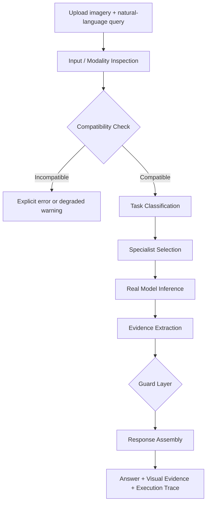

<p align="center">
  
  
  
  
  
  
</p>

<h1 align="center">🛰️ SatQuery AI</h1>

<p align="center">
  <strong>An Agentic Vision-Language Assistant for Multimodal Remote-Sensing Image Analysis</strong>
</p>

<p align="center">
  <em>Ask a satellite image a question in plain English.</em>
</p>

<p align="center">
  SatQuery AI converts natural-language questions into remote-sensing analysis workflows,
  selects the appropriate specialist model, executes the analysis, validates the result,
  and returns an evidence-backed answer with visual outputs and an auditable execution trace.
</p>

<p align="center">
  <a href="#-the-problem">Problem</a> •
  <a href="#-the-solution">Solution</a> •
  <a href="#-see-it-in-action">Demo</a> •
  <a href="#-capabilities">Capabilities</a> •
  <a href="#-innovation">Innovation</a> •
  <a href="#-evaluation">Evaluation</a> •
  <a href="#-architecture">Architecture</a> •
  <a href="#-getting-started">Getting Started</a>
</p>

---

## 🎯 The Problem

Remote-sensing imagery contains valuable information about land cover, infrastructure,
environmental change, and other geographic phenomena. Extracting that information,
however, often requires separate models, GIS workflows, preprocessing steps, and
knowledge of which specialist tool should be used for a particular question.

A user should not have to understand the underlying model stack before asking:

> **"What changed between these two satellite images?"**

or:

> **"Where are the water bodies?"**

or:

> **"What objects are visible in this image?"**

The challenge addressed by SatQuery AI is to turn these specialist remote-sensing
workflows into a unified natural-language interface while keeping the resulting
answers grounded in computed evidence.

Built for **Smart India Hackathon 2026**, Problem Statement **26167**, issued by
**ISRO / the Space Applications Centre (SAC)**.

---

## 💡 The Solution

SatQuery AI acts as an orchestration layer over multiple remote-sensing specialists.

```text
                    USER
                      │
                      │ Natural-language question
                      ▼
            ┌────────────────────┐
            │    SATQUERY AI     │
            │     ORCHESTRATOR   │
            └─────────┬──────────┘
                      │
              Query / Input Analysis
                      │
          ┌───────────┼────────────┐
          ▼           ▼            ▼
        VQA /       Change      Grounding
      Captioning   Detection
          │           │            │
          └───────────┼────────────┘
                      ▼
              Evidence Extraction
                      │
                Guard / Validation
                      │
                      ▼
            Answer + Visual Evidence
                      +
               Execution Trace
```

The system is not a single general-purpose chatbot. Each major capability is backed
by a specialist remote-sensing pipeline, while the orchestrator determines which
pipeline is appropriate for the request.

---

# 🎥 See It in Action

> **Add your final demo assets here.** Keep this section near the top of the README so
> a judge can understand the product before reading the implementation details.

### Recommended assets

```text
docs/
└── images/
    ├── hero.png
    ├── vqa-demo.png
    ├── change-detection.png
    ├── grounding.png
    ├── optical-sar.png
    └── execution-trace.png
```

### Example — Natural-language VQA

```text
┌──────────────────────────────┐
│       SATELLITE IMAGE        │
│                              │
│   🏢   🏢       🌳           │
│        🛣️                    │
│             💧               │
└──────────────────────────────┘

Question:
"What objects are visible in this image?"

                 ↓

Answer:
"Buildings, roads, vegetation and water are visible."

                 ↓

Visual evidence + execution trace
```

### Example — Bi-temporal analysis

```text
        BEFORE IMAGE              AFTER IMAGE
             │                         │
             └──────────┬──────────────┘
                        ▼
                 Change Detector
                        │
                        ▼
                  Binary Mask
                        │
                        ▼
             Change Statistics
                        │
                        ▼
              Evidence-backed
                    response
```

> Replace these conceptual examples with real screenshots/GIFs from the application
> before using the repository as the primary SIH showcase.

---

# 🚀 Capabilities

| Capability | What the user can do | Current engine |
|---|---|---|
| 🔍 **Remote-Sensing VQA** | Ask natural-language questions about imagery | SmolVLM-500M-Instruct + LoRA |
| 📝 **Scene Captioning** | Generate structured descriptions of scenes | SmolVLM-500M-Instruct + LoRA |
| 🎯 **Text-Guided Grounding** | Ask where objects/features are located | Grounding DINO |
| 🔄 **Bi-Temporal Change Detection** | Compare before/after imagery | Custom Siamese U-Net |
| 💬 **Change-VQA / Follow-up** | Ask questions about detected changes | Change detector + deterministic evidence reasoning |
| 🌐 **Optical + SAR Fusion** | Analyze co-registered Sentinel-1/2 imagery | Dual-branch gated fusion network |
| 🛡️ **Reliability Guards** | Detect incompatible/OOD/unreliable cases | Compatibility, hallucination, OOD and scope guards |
| 🤖 **Agentic Orchestration** | Route a query to the required specialist(s) | Task classifier + orchestrator |

---

# 💡 Innovation

## 1. Natural-language remote-sensing interface

Instead of requiring the user to manually choose a model or GIS workflow, the system
starts from the question.

```text
"What changed?"
       ↓
Task classification
       ↓
Change Detection
       ↓
Evidence
       ↓
Answer
```

## 2. Specialist orchestration

SatQuery AI connects multiple remote-sensing capabilities through one controller:

```text
Natural-language query
        ↓
Input / modality inspection
        ↓
Compatibility check
        ↓
Task classification
        ↓
Specialist selection
        ↓
Real model inference
        ↓
Evidence extraction
        ↓
Guard layer
        ↓
Answer + visual evidence + trace
```

## 3. Evidence-grounded response generation

Change detection and Optical+SAR fusion do not rely on unrestricted VLM narration
for numerical conclusions. Responses are constructed from computed detector/classifier
outputs.

This design was introduced after observed failures where free-form VLM narration
could introduce unsupported scene details.

## 4. Failure-aware architecture

The system explicitly handles:

- incompatible image pairs
- invalid modality combinations
- out-of-distribution inputs
- suspicious grounding boxes
- hallucination-prone caption content
- unsupported measurements

The objective is not to make every model appear perfect; it is to make model
limitations visible to the user.

## 5. Multimodal remote-sensing analysis

SatQuery AI combines:

- optical imagery
- SAR imagery
- single-image analysis
- bi-temporal imagery
- natural-language queries
- visual evidence

through one application.

---

# 🌍 Potential Applications

The current architecture supports workflows relevant to areas such as:

### 🏙️ Urban Monitoring
Analysis of built-up areas and changes between observations.

### 🌊 Change / Disaster Assessment
Before-and-after analysis of remote-sensing imagery.

### 🌾 Agricultural & Land-Cover Analysis
Natural-language exploration of land-cover composition.

### 🌲 Environmental Monitoring
Investigation of vegetation and land-cover changes.

### 🛰️ Multi-Modal Earth Observation
Joint analysis of Optical and SAR observations.

> These are application areas supported or targeted by the system architecture. They
> should not be presented as production deployments unless an actual deployment has
> been demonstrated.

---

# 📊 Evaluation

SatQuery AI is evaluated against the public benchmarks identified for the project,
rather than replacing them with easier substitute datasets.

A key design principle is:

> **Weak results are reported as weaknesses instead of being hidden or replaced by
> more favorable numbers.**

## Current results

| Benchmark | Task | Current evidence |
|---|---|---|
| **BigEarthNet** | VQA / captioning fine-tune validation | Training loss: 0.897 → 0.340; validation loss: 0.559 → 0.345 over 3 epochs; 63–73% held-out accuracy on binary/MCQ-style questions |
| **RSVQA-LR** | VQA accuracy by category | Official Zenodo release verified; category-level evaluation performed; Count category is weak |
| **VRSBench** | Captioning / VQA / grounding | Official release confirmed; grounding stress-tested on remote-sensing scenes |
| **CDVQA** | Change-based VQA | Structural limitation identified: binary change detection lacks semantic class information |
| **BigEarthNet-19** | Optical + SAR multi-label composition | Macro-F1: **0.482** |
| **Grounding DINO** | Zero-shot text-guided localization | Targeted 8-scene stress test: 3 correct, 1 partial, 4 failed |

### Important evaluation note

The current README contains benchmark coverage, but some benchmark entries still need
full numerical reporting before they should be presented as headline performance.

The evaluation table should ultimately report:

```text
Benchmark
Task
Official split
Number of samples (N)
Metric
SatQuery result
Baseline
Reference / published result where applicable
```

This prevents isolated numbers from being interpreted without context.

---

## 📈 Evaluation results currently available

### BigEarthNet-adapted VQA

```text
Training loss
0.897 ───────────────────────► 0.340

Validation loss
0.559 ───────────────────────► 0.345

Training: 3 epochs
Held-out accuracy: 63–73%
```

The current implementation uses:

- `SmolVLM-500M-Instruct`
- PEFT LoRA
- BigEarthNet-based adaptation

### Optical + SAR Fusion

```text
Model:
Dual-branch gated fusion network

Parameters:
1,045,299

Training:
20 epochs

Best validation macro-F1:
0.482
```

Reported stronger classes include:

| Class | F1 |
|---|---:|
| Arable land | 0.91 |
| Broad-leaved forest | 0.90 |
| Inland waters | 0.73 |
| Urban fabric | 0.70 |

Rare classes remain weaker, consistent with the multi-label class imbalance observed
during evaluation.

---

# 🧪 Evaluation Gaps & Honest Limitations

## Grounding DINO

The current Grounding DINO evaluation is a **targeted stress test**, not a
statistically representative benchmark.

Current test:

```text
8 manually verified scenes

Correct     3
Partial     1
Failed      4
```

The observed failure pattern is particularly relevant to:

- dense urban scenes
- dense industrial scenes
- very-wide-area imagery

The planned response is a remote-sensing-native grounding upgrade rather than
representing the current zero-shot result as solved.

## CDVQA

The current change detector produces a **binary change mask**.

Therefore it can answer questions involving:

- whether change occurred
- where change occurred
- how much area changed
- change severity/statistics

But it does not inherently encode semantic classes such as:

```text
"Did buildings change?"
"Did roads change?"
"Did vegetation change?"
```

A semantic multi-class change detector is therefore a planned architectural upgrade.

## VQA / Captioning confidence

SatQuery AI does not expose token likelihood as a fake "confidence score" for VQA or
captioning. Token probability is not treated as a correctness probability.

Where meaningful model-derived confidence is available, it is shown separately.

---

# 🧪 Recommended Evaluation Protocol

For reproducible future evaluations, each benchmark result should record:

```text
Dataset:
Official release:
Official split:
Number of samples:
Preprocessing:
Input resolution:
Checkpoint:
Model version:
Inference configuration:
Random seed:
Metric:
Result:
Baseline:
Evaluation date:
```

The repository's `evaluation_results/` directory should contain the generated result
tables and figures.

Recommended structure:

```text
evaluation/
├── configs/
├── scripts/
├── baselines/
├── results/
├── figures/
└── README.md
```

---

# 🔬 Ablation Studies

The most useful next experiments are not simply adding more models. They are
experiments that demonstrate what each SatQuery component contributes.

## VQA adaptation ablation

```text
Base SmolVLM
      vs
SmolVLM + Remote-Sensing LoRA
```

Report the same held-out evaluation set for both.

## Orchestrator ablation

```text
Direct specialist call
        vs
Static routing
        vs
SatQuery orchestrator
```

Measure:

- correct task selection
- execution success
- invalid-input handling
- specialist routing errors

## Guard ablation

```text
Model output without guard
        vs
Model output with guard
```

Measure:

- hallucinated measurements
- invalid localization
- OOD cases
- incompatible-input failures

> These experiments should be added to the repository only after they have actually
> been run. No baseline or improvement number should be fabricated.

---

# 🏗️ Architecture

```text
┌──────────────────────────────────────────────────────────────────────────┐
│                           SATQUERY AI PLATFORM                           │
├──────────────────────────────────────────────────────────────────────────┤
│                                                                          │
│  ┌────────────────────────────────────────────────────────────────────┐  │
│  │                    Frontend — React + TypeScript + Vite            │  │
│  │                                                                    │  │
│  │   Upload Portal   Analysis Console   Execution Trace   History     │  │
│  └───────────────────────────────┬────────────────────────────────────┘  │
│                                  │                                       │
│                                  ▼                                       │
│  ┌────────────────────────────────────────────────────────────────────┐  │
│  │                     FastAPI Backend — Python                       │  │
│  │                                                                    │  │
│  │  ┌──────────────────────────────────────────────────────────────┐  │  │
│  │  │                Input Compatibility Layer                     │  │  │
│  │  │ Modality / Format Check → Pair Validation → Input Guard     │  │  │
│  │  └──────────────────────────────┬───────────────────────────────┘  │  │
│  │                                 ▼                                  │  │
│  │  ┌──────────────────────────────────────────────────────────────┐  │  │
│  │  │              Task Classifier & Orchestrator                  │  │  │
│  │  │       Query Intent → Tool Selection → Dispatch              │  │  │
│  │  └───────────┬────────────┬──────────────┬──────────────────────┘  │  │
│  │              ▼            ▼              ▼                         │  │
│  │         ┌─────────┐  ┌──────────┐  ┌──────────────┐               │  │
│  │         │ RS-VQA  │  │ Change   │  │ Optical+SAR  │               │  │
│  │         │ /Caption│  │ Detector │  │   Fusion     │               │  │
│  │         └─────────┘  └──────────┘  └──────────────┘               │  │
│  │              │            │              │                         │  │
│  │              └────────────┼──────────────┘                         │  │
│  │                           ▼                                        │  │
│  │                  ┌─────────────────┐                               │  │
│  │                  │ Text Grounding  │                               │  │
│  │                  │ Grounding DINO  │                               │  │
│  │                  └────────┬────────┘                               │  │
│  │                           ▼                                        │  │
│  │  ┌──────────────────────────────────────────────────────────────┐  │  │
│  │  │                 Guard + Evidence Assembly                   │  │  │
│  │  │ Hallucination Guard │ OOD Guard │ Scope Guard │ Validation │  │  │
│  │  └──────────────────────────────┬───────────────────────────────┘  │  │
│  │                                 ▼                                  │  │
│  │                       Answer + Evidence + Trace                   │  │
│  │                                                                    │  │
│  │  SQLite Storage              JWT + Google/GitHub OAuth             │  │
│  └────────────────────────────────────────────────────────────────────┘  │
└──────────────────────────────────────────────────────────────────────────┘
```

---

# 🔄 Agentic Workflow



### Mode 1 — Single Image

```text
Optical / SAR image
       ↓
Modality & format detection
       ↓
Task classification
       ↓
┌──────────────────────────────┐
│ VQA / Captioning             │ → SmolVLM + LoRA
│ Grounding                    │ → Grounding DINO
└──────────────────────────────┘
       ↓
Guard layer
       ↓
Answer + evidence + trace
```

### Mode 2 — Bi-Temporal Change Detection

```text
Before (T1) + After (T2)
          ↓
Pair compatibility validation
          ↓
Siamese U-Net
          ↓
Binary change mask
          ↓
% changed + severity + location
          ↓
OOD guard
          ↓
Deterministic evidence-based answer
          ↓
Follow-up questions reuse computed evidence
```

### Mode 3 — Optical + SAR Fusion

```text
Sentinel-2 Optical + Sentinel-1 SAR
                ↓
        Co-registration /
        input handling
                ↓
        Dual-branch encoders
                ↓
         Learned sigmoid gate
                ↓
      Multi-label composition
                ↓
        OOD guard + validation
                ↓
        Evidence-based answer
```

---

# 🤖 Specialist Tool Registry

| Specialist | Engine | Domain | Status |
|---|---|---|---|
| **RS-VQA** | SmolVLM-500M-Instruct + LoRA | BigEarthNet-adapted VQA | 🟢 Active |
| **RS Captioning** | SmolVLM-500M-Instruct + LoRA | Scene description | 🟢 Active |
| **Text-Guided Grounding** | Grounding DINO | Zero-shot localization | 🟢 Active |
| **Change Detector** | Custom Siamese U-Net | LEVIR-CD building change | 🟢 Active |
| **Change-VQA** | Change detector + evidence reasoning | Change narratives | 🟢 Active |
| **Optical+SAR Fusion** | Dual-branch gated network | Sentinel-1/2 analysis | 🟢 Active |
| **Hallucination Guard** | Rule-based filter | Unsupported generated details | 🟢 Active |
| **OOD Guard** | Statistical z-score check | Distribution-shift detection | 🟢 Active |
| **Semantic Change Detection** | Multi-class change upgrade | Class-aware change | 🔵 Roadmapped |
| **LAE-DINO Grounding** | Remote-sensing-native detector | Dense/wide-area grounding | 🔵 Roadmapped |

---

# 🧠 Model Details

## RS-VQA / Captioning — SmolVLM-500M-Instruct + LoRA

| Detail | Value |
|---|---|
| Base model | `HuggingFaceTB/SmolVLM-500M-Instruct` |
| Adaptation | PEFT LoRA |
| Training data | BigEarthNet-based adaptation |
| Training | 3 epochs |
| Train loss | 0.897 → 0.340 |
| Validation loss | 0.559 → 0.345 |
| Held-out accuracy | 63–73% on binary/MCQ-style questions |
| Safety layer | Rule-based hallucination guard |

## Change Detection — Custom Siamese U-Net

| Detail | Value |
|---|---|
| Architecture | Weight-shared Siamese encoder |
| Feature processing | Multi-level feature differencing |
| Parameters | 7.76M |
| Training data | LEVIR-CD |
| Output | Binary change mask |
| Derived statistics | % changed, severity, location |
| Answer generation | Deterministic templates from detector statistics |

## Optical + SAR Fusion

| Detail | Value |
|---|---|
| Architecture | Dual-branch gated fusion |
| Optical input | 3-channel |
| SAR input | 2-channel |
| Fusion | Learned sigmoid gate |
| Parameters | 1,045,299 |
| Training | 20 epochs |
| Dataset | BigEarthNet Sentinel-1/2 pairs |
| Supervision | Weak multi-label |
| Best macro-F1 | 0.482 |

## Grounding — Grounding DINO

| Detail | Value |
|---|---|
| Mode | Zero-shot open-vocabulary detection |
| Remote-sensing fine-tune | None in current implementation |
| Output | Bounding boxes + detection confidence |
| Guard | Near-full-image boxes flagged as unreliable localization |

---

# 🛡️ Safety & Reliability Engineering

Reliability is treated as part of the architecture rather than an afterthought.

## Hallucination Guard

Captioning output is filtered for unsupported details such as:

- fabricated country names
- invented area measurements
- made-up capture dates

Rules were tested against false-positive traps such as:

- pixel dimensions
- aspect ratios
- scale bars

## Deterministic Evidence Generation

Change detection and fusion outputs are built from actual computed statistics instead
of allowing unrestricted VLM narration to invent measurements or scene details.

## OOD Guard

A statistical distribution-shift check compares input characteristics against a
training-distribution reference profile.

The design was extended after cross-dataset testing revealed coverage gaps.

## Grounding Scope Guard

Bounding boxes covering most of the image are treated as suspicious localization
rather than automatically being presented as reliable object detections.

## No Silent Failures

Invalid or incompatible scenarios produce an explicit error or traced degraded
warning rather than silently executing an inappropriate model.

Examples include:

- wrong number of images
- mismatched pair dimensions
- incompatible modalities
- invalid cross-modal input

---

# 📂 Project Structure

```text
SatQuery-AI/
│
├── backend/
│   ├── app/
│   │   ├── main.py
│   │   ├── models.py
│   │   ├── routers/
│   │   │   ├── auth.py
│   │   │   ├── analysis.py
│   │   │   ├── reports.py
│   │   │   └── health.py
│   │   └── services/
│   │       ├── orchestrator.py
│   │       ├── task_classifier.py
│   │       ├── vqa_service.py
│   │       ├── change_service.py
│   │       ├── fusion_service.py
│   │       ├── grounding_service.py
│   │       ├── hallucination_guard.py
│   │       ├── ood_guard.py
│   │       └── geo_preprocessing.py
│   │
│   ├── tests/
│   └── evaluation_results/
│
├── frontend/
│   └── src/
│       ├── components/
│       └── pages/
│
├── evaluation/
│   ├── configs/
│   ├── scripts/
│   ├── baselines/
│   ├── results/
│   └── figures/
│
├── docs/
│   ├── images/
│   ├── architecture.md
│   ├── evaluation.md
│   ├── models.md
│   ├── safety.md
│   ├── datasets.md
│   └── api.md
│
├── .env.example
├── .gitignore
├── README.md
└── SECURITY.md
```

---

# ⚙️ Getting Started

## Backend

```bash
cd backend

python -m venv venv
```

### Windows

```bash
venv\Scripts\activate
```

### macOS / Linux

```bash
source venv/bin/activate
```

Install dependencies:

```bash
pip install -r requirements.txt
```

Start the API:

```bash
uvicorn app.main:app --reload --host 127.0.0.1 --port 8000
```

Backend:

```text
http://127.0.0.1:8000
```

Swagger:

```text
http://127.0.0.1:8000/docs
```

Health check:

```text
http://127.0.0.1:8000/health
```

## Frontend

```bash
cd frontend
npm install
```

Create your environment file:

```bash
cp .env.example .env
```

Configure:

```env
VITE_API_URL=http://localhost:8000
```

Start:

```bash
npm run dev
```

Frontend:

```text
http://localhost:5173
```

---

# 🧪 Real Mode vs Mock Mode

The backend supports mock routing for fast, GPU-free development/testing.

Real inference loads the actual model components.

Configure the relevant environment variables:

```env
VQA_MODE=real
CHANGE_MODE=real
FUSION_MODE=real
GROUNDING_MODE=real
```

Default development behavior may use mock modes to avoid loading the complete model
stack.

> Do not publish real credentials, private model access tokens, database passwords,
> OAuth secrets, or service-role keys in the repository.

---

# 📡 API Overview

| Method | Endpoint | Purpose | Auth |
|---|---|---|---|
| `POST` | `/analysis` | Run a query against uploaded imagery | Optional |
| `GET` | `/analysis/{id}` | Retrieve a past analysis | Optional |
| `GET` | `/analysis/history` | List analyses for the user | Required |
| `POST` | `/auth/register` | Create an account | — |
| `POST` | `/auth/login` | Email/password login | — |
| `GET` | `/auth/google/login` | Google OAuth login | — |
| `GET` | `/auth/github/login` | GitHub OAuth login | — |
| `GET` | `/auth/me` | Current user profile | Required |
| `GET` | `/health` | Liveness check | — |

The authoritative route list is defined by the backend router implementation.

---

# 🔐 Security

Before making this repository public:

- Never commit `.env` files.
- Never commit API keys.
- Never commit database passwords.
- Never commit OAuth secrets.
- Never commit JWT signing secrets.
- Never commit private SSH keys.
- Never commit cloud credentials.
- Rotate any credential that has previously been committed.
- Use GitHub secret scanning / push protection where available.
- Keep privileged backend credentials out of frontend code.

Recommended files:

```text
.env
.env.*
!.env.example

*.pem
*.key

__pycache__/
*.pyc
.venv/
node_modules/
dist/
build/
```

Large model checkpoints should be handled separately from normal source-code commits
where appropriate.

---

# 🧭 Roadmap

## Phase 1 — Close Evaluation Gaps

- Complete quantitative VRSBench reporting
- Complete quantitative CDVQA reporting
- Add baseline comparisons
- Expand grounding evaluation
- Add reproducible evaluation scripts
- Semantic multi-class change detection
- Remote-sensing-native grounding upgrade
- Confidence calibration research for VQA/captioning

## Phase 2 — Mission-Oriented Workflows

- Scheduled monitoring and change alerts
- GIS map interface with georeferenced overlays
- Automated Sentinel-1/2 acquisition
- Flood extent workflow
- Crop-stage change workflow
- Encroachment detection
- Deforestation tracking

## Phase 3 — Platform Hardening

- Multi-user organizations
- Per-account data isolation
- Human-in-the-loop validation
- Model registry and versioning
- Expanded geographic/entity reasoning

## Long-Term Direction

Explore a continuously running Earth-observation monitoring layer using suitable
optical and SAR imagery while preserving the evidence-backed orchestration design.

---

# 📚 Technical Documentation

Detailed documentation should live separately from the top-level project story:

```text
docs/
├── architecture.md    # System and service architecture
├── evaluation.md      # Benchmark protocols, metrics and results
├── models.md          # Model architectures and checkpoints
├── safety.md          # Guards, failure modes and negative controls
├── datasets.md        # Dataset versions, splits and preprocessing
└── api.md             # Endpoint and request/response documentation
```

The README is intentionally designed as the **project overview**. Detailed
implementation notes belong in these documents so that judges can understand the
project quickly without removing technical depth for developers and reviewers.

---

# 👥 Team

<p align="center">
  <strong>Orbital Minds 133</strong>
</p>

<p align="center">
  Smart India Hackathon 2026 · Problem Statement 26167
</p>

---

# 📌 Current Limitations

SatQuery AI is an active research/engineering project, not a claim of solved
general-purpose remote-sensing intelligence.

Current limitations include:

- Binary rather than semantic change detection
- Weak fine-grained counting performance on RSVQA-LR
- Zero-shot Grounding DINO degradation on dense/wide-area imagery
- Lower performance on rare Optical+SAR classes
- Incomplete quantitative reporting for some benchmark tasks
- Limited size of the current Grounding DINO stress-test set

These limitations are explicitly retained because reproducible evaluation should show
where the system currently works and where it does not.

---

# 🏁 Why SatQuery AI

SatQuery AI brings multiple remote-sensing capabilities behind a single interaction:

```text
                    ASK
                     │
                     ▼
              Natural Language
                     │
                     ▼
               ORCHESTRATE
                     │
       ┌─────────────┼─────────────┐
       ▼             ▼             ▼
      VQA          CHANGE       GROUNDING
       │          DETECTION         │
       └─────────────┼──────────────┘
                     ▼
                  EVIDENCE
                     │
                     ▼
             ANSWER + VISUALS
                     +
                EXECUTION TRACE
```

The goal is not simply to place a language model on top of satellite imagery.

The goal is to make remote-sensing analysis **queryable, composable, traceable, and
explicit about its limitations**.

<p align="center">
  <em>Built for judges who read the code, not just the demo.</em>
</p>
